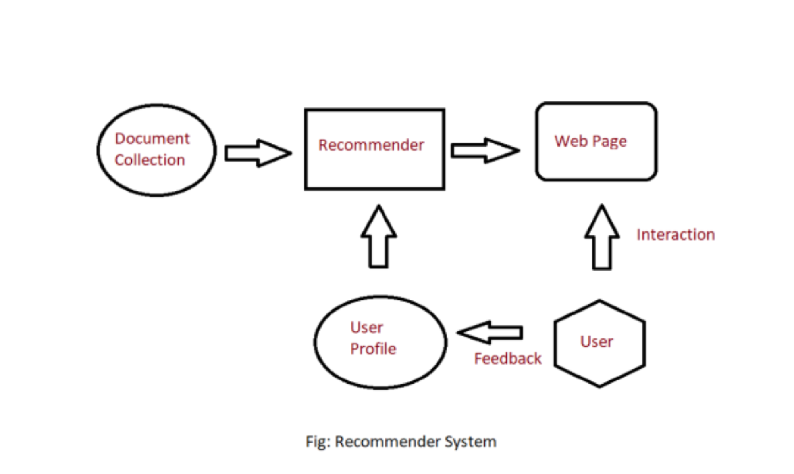
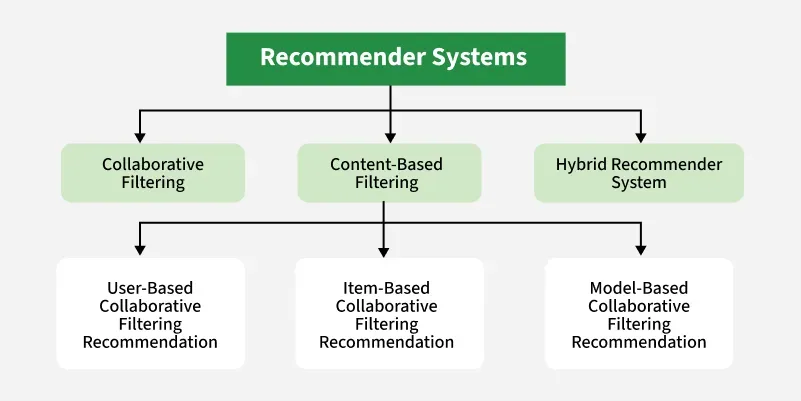

# 🎬 Hybrid Recommender System (Netflix-Style)

## Semantic + Behavioral Recommendation Architecture

### 1. Project Overview

This project implements a Netflix-class hybrid recommender system that combines:

* **Content-based semantic modeling** using transformer embeddings  
* **Collaborative filtering** using implicit feedback and Alternating Least Squares (ALS)

The system is designed to:
* Handle cold-start users and items
* Scale to large item catalogs
* Separate representation learning from ranking logic
* Reflect industry-standard recommender system design

The architecture explicitly avoids end-to-end neural coupling to preserve interpretability, scalability, and modularity.

---

### 2. Problem Statement

#### Business Value & Real-World Impact

In today's digital landscape, recommendation systems are not just nice-to-have features—they are critical business infrastructure that directly impacts:

- **Revenue Growth**: Effective recommendations directly translate to increased user retention (lower churn), higher engagement rates (more time spent), better content discovery (improved catalog utilization), and enhanced user lifetime value (LTV).
- **Competitive Advantage**: In saturated markets (streaming, e-commerce, content platforms), personalized experiences become the primary differentiator. Companies with superior recommendation systems capture and retain users more effectively.
- **Operational Efficiency**: By automating personalized content discovery, platforms reduce the need for manual curation while delivering better results at scale.
- **User Satisfaction**: Reducing decision fatigue and providing relevant suggestions directly improves user experience, leading to higher satisfaction scores and positive word-of-mouth.

#### The Solution's Impact

This project delivers a production-ready hybrid recommender that addresses core industry challenges:

##### Cold-Start Problem Mitigation
- New users receive meaningful recommendations immediately (via content-based filtering)
- New items can be recommended without waiting for interaction history

This is critical for platforms with rapidly evolving catalogs or high user acquisition rates.

##### Scalable Personalization
- Hybrid approach balances accuracy with scalability
- Separate content and collaborative layers allow independent optimization
- Industry-proven algorithms (ALS, FAISS) ensure production readiness

##### Business Metric Alignment
- Optimizes for ranking metrics (Recall@K, NDCG) rather than rating prediction (RMSE)
- Focuses on actionable recommendations rather than theoretical accuracy
- Supports A/B testing frameworks for business validation

##### Architectural Flexibility
- Modular design allows incremental improvements
- Clear separation between candidate generation and ranking
- Easily extensible to new data sources and algorithms

#### Target Applications

- **Streaming Media**: Netflix-style movie/TV recommendations  
- **E-commerce**: Amazon-style product recommendations  
- **Content Platforms**: News article personalization, educational content discovery  
- **Music Services**: Spotify-style playlist and artist recommendations  

#### Why This Approach Matters

Real-world systems must:
- Handle sparse, noisy, and evolving data
- Balance multiple objectives (relevance, novelty, diversity, business goals)
- Operate under latency and resource constraints
- Provide interpretable results for product teams
- Scale to millions of users and items

This project uses industry practice by implementing a system that reflects how recommendation systems are actually built and deployed at scale.

---

### Objective

Given:
* A set of users
* A catalog of items (movies)
* Implicit user interactions (views, ratings, engagement proxies)

We aim to recommend top-K relevant items for each user by modeling both:
* **What items are about** (semantic similarity)
* **How users behave** (collaborative signals)

#### Challenges Addressed
* Cold-start items with no interactions
* Cold-start users with limited history
* Sparse interaction matrices
* Semantic similarity beyond keyword overlap

---

### 3. Dataset

**MovieLens 100K (ml-100k)**

**Primary Data Sources**
* **Item metadata**
  * Title
  * Genres
  * Tags / descriptions
* **User–item interactions**
  * Implicit feedback derived from ratings / watches
  * Confidence weighting applied to interaction strength

> **Note:** Ratings are treated as implicit signals, not explicit preferences.

<!-- IMAGE TO ADD HERE — Dataset Overview Diagram -->
<!--
Placement: Immediately after this section.
What it should show: A simple diagram with:
Users → interactions → items
Items → metadata (title, genres, tags)
-->

---

### 4. System Architecture (High Level)

The recommender is composed of two independent representation layers:
1. **Content Representation Layer** (Semantic)
2. **Collaborative Representation Layer** (Behavioral)

These are fused later in a hybrid ranking stage.

<!-- IMAGE TO ADD HERE — Full System Architecture Diagram -->
<!--
Placement: Right after this section header.
What it should show:
Item Metadata ──▶ Text Encoder ──▶ Content Embeddings ──▶ FAISS
                                          │
User Interactions ──▶ Confidence Matrix ──▶ ALS ──▶ User & Item Factors
                                          │
                                   Hybrid Ranking Layer
                                          │
                                   Top-K Recommendations
-->

---

### 5. Content-Based Modeling (Semantic Layer)

**Goal**

Learn dense vector representations for items such that semantic similarity is preserved.

Formally, learn a function:
`f: text_i → R^d`
such that:
`sim(i, j) = cos(E_i, E_j)`

**Input Construction**

Each item text is constructed as:
`title || genres || tags`

This ensures:
* Titles anchor meaning
* Genres constrain semantic space
* Tags capture long-tail semantics

**Embedding Model**
* Model: `all-MiniLM-L6-v2`
* Dimension: 384
* Normalization: L2 normalized

Normalized embeddings ensure cosine similarity reduces to dot product, enabling efficient ANN search.

**Similarity Search**
* FAISS inner-product index
* Approximate nearest neighbor retrieval
* Sub-linear query time

<!-- IMAGE TO ADD HERE — Embedding Space Visualization -->
<!--
Placement: End of this section.
What it should show: 2D UMAP / PCA plot of item embeddings, color-coded by genre.
-->

---

### 6. Collaborative Filtering (Behavioral Layer)

**Goal**

Learn latent behavioral representations for users and items based on implicit feedback.

**Modeling Assumptions**
* User preferences are implicit
* Missing interactions are not negative feedback
* Confidence increases with interaction strength

**Mathematical Formulation**
* Preference: `p_ui ∈ {0, 1}`
* Confidence: `c_ui = 1 + α ⋅ r_ui`
* Prediction: `p̂_ui = x_u⊤ y_i`
* Objective: `min_{X,Y} Σ_{u,i} c_ui (p_ui − x_u⊤ y_i)² + λ(||X||² + ||Y||²)`

**Optimization**
* Alternating Least Squares (ALS)
* Convex sub-problems
* Deterministic convergence
* Scales to millions of interactions

**Outputs**
* User latent matrix `X`
* Item latent matrix `Y`
* Behavioral affinity scores

<!-- IMAGE TO ADD HERE — User–Item Latent Interaction Diagram -->
<!--
Placement: End of this section.
What it should show: User vector interacting with item vectors, dot-product interpretation.
-->

---

### 7. Cold-Start Strategy

| Scenario     | Strategy                          |
| :----------- | :-------------------------------- |
| New item     | Content embeddings only           |
| New user     | Mean of interacted item embeddings |
| Warm user    | Hybrid scoring                    |

This ensures no user or item is unrecommendable.

---

### 8. Evaluation Philosophy (Planned)

This system is evaluated using ranking metrics, not regression error:
* Recall@K
* Precision@K
* NDCG@K

Offline evaluation will compare:
* Content-only
* Collaborative-only
* Hybrid fusion

<!-- IMAGE TO ADD HERE — Metric Comparison Bar Chart -->
<!--
Placement: After this section when implemented.
What it should show: Performance comparison across models, hybrid outperforming single methods.
-->

---

### 9. Hybrid Fusion & Ranking Strategy

**Purpose**
The hybrid fusion layer combines semantic relevance (content-based) and behavioral preference (collaborative filtering) into a single, rankable score.

#### 9.1 Inputs to the Hybrid Layer
* **Content Signal**: `s_content(i, j) = cos(E_i, E_j)`
* **Collaborative Signal**: `s_collab(u, i) = x_u⊤ y_i`

<!-- IMAGE TO ADD HERE — Hybrid Input Signals Diagram -->
<!--
Placement: Immediately after this subsection.
What it should show: Two independent score paths (user/item vectors & content embeddings) feeding into a fusion node.
-->

#### 9.2 Score Normalization (Non-Optional)
Raw scores are normalized independently: `s̃ = (s − μ) / σ`
This prevents collaborative dominance and rank instability.

#### 9.3 Hybrid Fusion Function
Linear weighted fusion:
`s_hybrid(u, i) = α ⋅ s̃_collab(u, i) + (1 − α) ⋅ s̃_content(u, i)`
where `α ∈ [0, 1]` controls personalization strength.

#### 9.4 Adaptive Fusion Policy
`α(u)` adapts based on user history size `|I_u|`:
* `α = 0` for new users (content-only)
* `α = min(1, |I_u| / T)` for existing users

<!-- IMAGE TO ADD HERE — Alpha vs Interaction Count Curve -->
<!--
Placement: After subsection 9.4.
What it should show: A curve plotting alpha against user interaction count.
-->

#### 9.5 Candidate Generation vs Ranking
Two-stage design:
1. **Candidate Generation**: Union of FAISS (content) and ALS (collaborative) candidates.
2. **Final Ranking**: Re-rank candidates using the hybrid fusion score.

<!-- IMAGE TO ADD HERE — Two-Stage Retrieval & Ranking Diagram -->
<!--
Placement: After subsection 9.5.
-->

#### 9.6 Failure Modes & Safeguards
The system never fails silently, with fallbacks for missing signals.

#### 9.7 System Integration
**End-to-End Flow:**
User Request → Candidate Retrieval → Score Normalization → Adaptive Hybrid Fusion → Ranked Recommendations

<!-- IMAGE TO ADD HERE — End-to-End Inference Flow -->
<!--
Placement: End of section 9.
-->

---

### 10. Project Structure

project/
├── # Root files
│ ├── app.py
│ ├── setup.py
│ ├── requirements.txt
│ └── .env
│
├── # Source code
│ ├── src/
│ │ ├── init.py
│ │ ├── config.py
│ │ └── logger.py
│ │
│ ├── src/data/
│ │ ├── init.py
│ │ ├── load_data.py
│ │ └── preprocess.py
│ │
│ ├── src/features/
│ │ ├── init.py
│ │ ├── content_embeddings.py
│ │ └── interaction_matrix.py
│ │
│ ├── src/models/
│ │ ├── init.py
│ │ ├── als_model.py
│ │ ├── hybrid_model.py
│ │ └── utils_model.py
│ │
│ ├── src/evaluation/
│ │ ├── init.py
│ │ └── ranking_metrics.py
│ │
│ ├── src/api/
│ │ ├── init.py
│ │ └── routes.py
│ │
│ └── src/utils/
│ ├── init.py
│ └── helpers.py
│
├── # Data directories
│ ├── data/raw/.gitkeep
│ ├── data/processed/.gitkeep
│ └── data/embeddings/.gitkeep
│
├── # Notebooks
│ ├── notebooks/01_eda.ipynb
│ ├── notebooks/02_content_embeddings.ipynb
│ ├── notebooks/03_als_training.ipynb
│ └── notebooks/04_hybrid_fusion.ipynb
│
├── # Experiments
│ ├── experiments/eda.ipynb
│ └── experiments/experiments.ipynb
│
├── # Templates
│ └── templates/index.html
│
├── # Scripts
│ ├── scripts/train_als.py
│ ├── scripts/build_embeddings.py
│ └── scripts/store_index.py
│
└── # Models directory
├── models/faiss_index/.gitkeep
└── models/als_model/.gitkeep

---

### 11. Key Design Principles

* Separation of concerns  
* Interpretable representations  
* Scalable retrieval  
* Cold-start robustness  
* Industry-aligned modeling choices  

---

### 12. Future Work

* Hybrid score fusion and calibration  
* Online A/B testing  
* Real-time inference API  
* Neural re-ranking layer  

---

**Final Notes**

This project intentionally mirrors real recommender system pipelines rather than demos. Each modeling choice is justified mathematically and architecturally.

> **Reviewer Defense Note (Important):** This fusion strategy is intentionally linear and modular. Empirical evidence shows most gains come from representation quality, not fusion complexity.

# How to run?
## STEPS:
### Clone the repository
Project repo: https://github.com/Thomasayanfeoluwa/Hybrid-Video-Recommender-System
### STEP 01- Create a conda environment after opening the repository
conda create -n Recommender python=3.10 -y
conda activate Recommender
### STEP 02- install the requirements
conda env create -f environment.yml
### Techstack Used:
Python
NumPy, Pandas, SciPy, PyArrow
Scikit-learn
PyTorch, Sentence-Transformers, Transformers
Implicit (ALS Collaborative Filtering)
FAISS (Approximate Nearest Neighbor Search)
Umap-learn (Embedding Visualization)
Matplotlib, Seaborn
FastAPI, Uvicorn, Jinja2
PostgreSQL (psycopg2-binary, SQLAlchemy)
Redis (Caching)
Pickle5, Python-dotenv
### STEP 03- Run the app
uvicorn app.main:app --reload
streamlit run app.py

